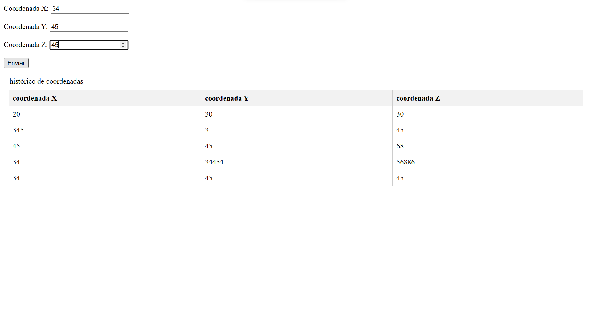
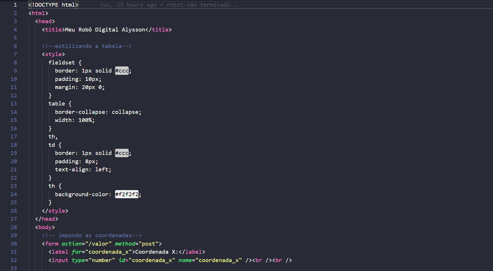
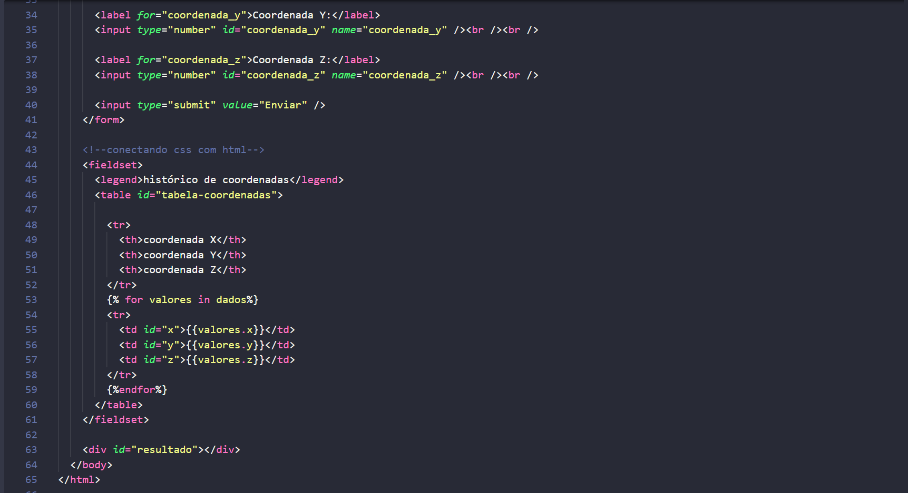
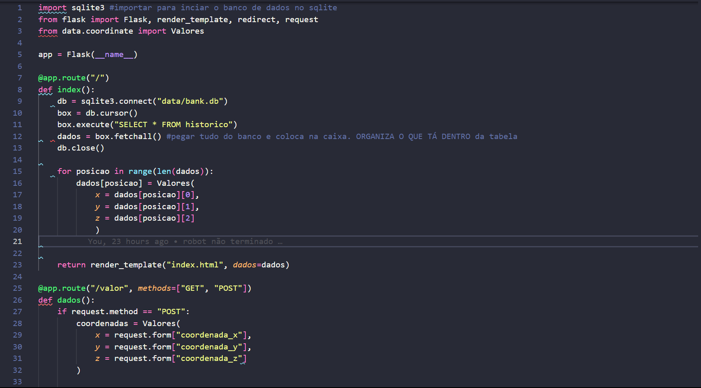
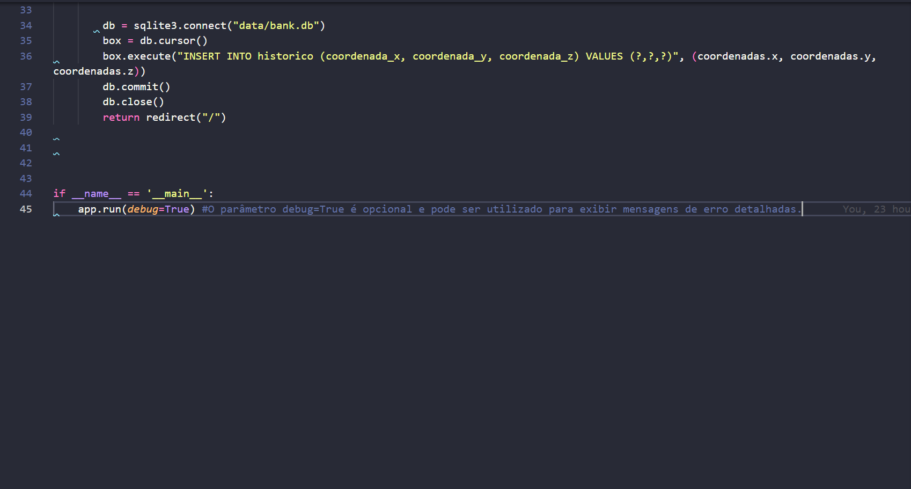

# INTELI - Projeto Robot-Aly Doc

### Autor: 
---
- ```Alysson Cordeiro```
  
---

## VISÃO GERAL DO PROJETO.
---
### ```PROPOSTA:```
O INTELI, em colaboração com o professor de programação Murilo Zanini de Carvalho, propôs uma atividade desafiadora para os alunos do 2º ano de Engenharia da Computação, com o objetivo de fornecer aprendizado prático e aplicar conhecimentos de Automação Industrial (TA) e Tecnologia de Automação (TI) desenvolvidos durante as sprints do Módulo 6."


### ```OBJETIVO:```
O ```Robô Digital``` visa a integração de diversas aplicações, incluindo editores de código, banco de dados e motores gráficos para jogos 3D. Ele consiste em fazer com que os dados inseridos em uma extremidade passem por todas as plataformas e sejam processados na outra extremidade.
``` ```

## DESENVOLVIMENTO E INTEGRAÇÃO:
A integração une as partes do projeto que foram desenvolvidas separadamente: ```Front-End```, ```Back-End``` e uma ```Simulação``` representativa. Cada um representa o desenvolvimento parcial do projeto, e a união deles resultará na solução final proposta. Vamos começar com o Front-End.

### ```Front-End```
Foi construído uma interface simplista no front, onde tem 3 caixas para colocar qualquer valor de acordo com que desejar. Nessas caixas (inputs) ao enviar irá aparecer uma tabela com os hitóricos dos valores. Veja a imagem a seguir:


##### <i>Imagem 1</i>

Foi construido utilizando a linguagem HTML e css.


##### <i>Imagem 2</i>


##### <i>Imagem 3</i>
---

## ```Back-End```
No desenvolvimento do backend, o código de base que contém as regras de negócio e faz a comunicação com outras plataformas, utilizamos o Framework Web Flask, que possui ferramentas que facilitam o desenvolvimento de aplicações, e a linguagem de programação Python. Para armazenar os dados gerados pela aplicação, foi utilizado o Banco de Dados SQLite.
 
Além do mais, a imagem abaixo mostra o resultado do desenvolvimento do Backend com as regras de negócio, já comentado para melhor leitura e interpretação das funcionalidades (APIs). É importante destacar que toda a aplicação é executada localmente (localhost).


##### <i>Imagem 4</i>


##### <i>Imagem 5</i>
---

## ```Simulação```
Foi escolhido pelo instrutores e professores o uso do freamework GODOT, que é um motor de jogo multiplataforma de código aberto, utilizado para desenvolver jogos 2D e 3D, além de aplicações interativas e animações. Ele oferece um ambiente integrado de desenvolvimento (IDE) que inclui ferramentas para a criação de interfaces gráficas do usuário, animações, lógica do jogo e física, entre outros recursos.
No entanto, a máquina da qual estava sendo usada estava dificuldade de ler o freamwork. Travava e não abria.
A simulação era o efeito didático de como iria ficar visualmente o robô digital com as coordenadas digitadas no front.

---
## CONCLUSÃO:
A Tecnologia de Automação  e a Tecnologia de Informação são aliadas no aumento da produção de sistemas automatizados. A integração de diferentes plataformas pode trazer grandes avanços tecnológicos. No exercício, aplicamos nosso conhecimento em programação para unir um site e um jogo, mas no mundo real, há inúmeras aplicações em negócios e na indústria.

---

## AGRADECIMENTO:
- ```professor Murilo Zanini```
- ```Kil Mateus``` que me ajudou muito explicando como se produzir um projeto como esse.